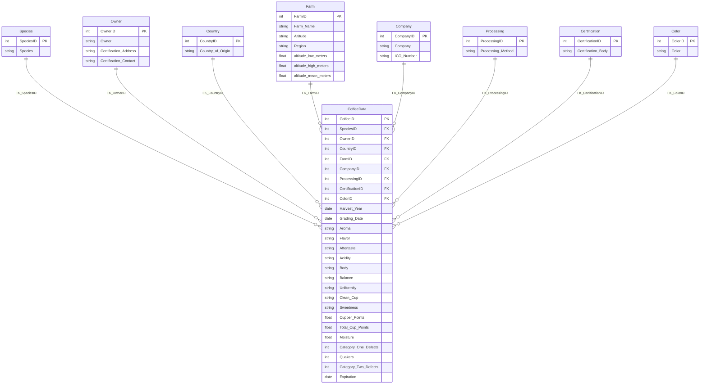

# Coderhouse

```mermaid
  erDiagram
    Species ||--o{ CoffeeData : "FK_SpeciesID"
    Owner ||--o{ CoffeeData : "FK_OwnerID"
    Country ||--o{ CoffeeData : "FK_CountryID"
    Farm ||--o{ CoffeeData : "FK_FarmID"
    Company ||--o{ CoffeeData : "FK_CompanyID"
    Processing ||--o{ CoffeeData : "FK_ProcessingID"
    Certification ||--o{ CoffeeData : "FK_CertificationID"
    Color ||--o{ CoffeeData : "FK_ColorID"

    Species {
        int SpeciesID PK
        string Species
    }

    Owner {
        int OwnerID PK
        string Owner
        string Certification_Address
        string Certification_Contact
    }

    Country {
        int CountryID PK
        string Country_of_Origin
    }

    Farm {
        int FarmID PK
        string Farm_Name
        string Altitude
        string Region
        float altitude_low_meters
        float altitude_high_meters
        float altitude_mean_meters
    }

    Company {
        int CompanyID PK
        string Company
        string ICO_Number
    }

    Processing {
        int ProcessingID PK
        string Processing_Method
    }

    Certification {
        int CertificationID PK
        string Certification_Body
    }

    Color {
        int ColorID PK
        string Color
    }

    CoffeeData {
        int CoffeeID PK
        int SpeciesID FK
        int OwnerID FK
        int CountryID FK
        int FarmID FK
        int CompanyID FK
        int ProcessingID FK
        int CertificationID FK
        int ColorID FK
        date Harvest_Year
        date Grading_Date
        string Aroma
        string Flavor
        string Aftertaste
        string Acidity
        string Body
        string Balance
        string Uniformity
        string Clean_Cup
        string Sweetness
        float Cupper_Points
        float Total_Cup_Points
        float Moisture
        int Category_One_Defects
        int Quakers
        int Category_Two_Defects
        date Expiration
    }

```
